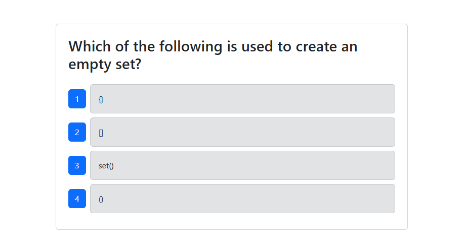

# K Tech Quiz
  
  ## Description
  This application will give user 10 questions about Python. Once user start the quiz, there will be 10 multiple choice questions. After answering all ten questions, it will give user their score on how many questions they have answered correctly out of the 10 questions. It will also give user the option to take the quiz again.
  ## Table of Contents
  * [Installation](#installation)
  * [Usage](#usage)
  * [Credits](#credits)
  * [License](#license)
  * [Badges](#badges)
  * [Features](#features)
  * [How to Contribute](#howToContribute)
  * [Test](#test)
  ## Installation
  This application will be available on github. Copying the SSH link and do a `git clone` on the terminal will clone this repository. 
  Once the code is opened on the local device, open a terminal and do `npm install` `npm run build` `npm run seed` and `npm run start:dev`.
  ## Usage
  `npm install`  
  `npm run build`  
  `npm run seed` 
  `npm run start:dev` 
  in order to test the code first: 
  `npm run test`   
  
  ## Credits
  N/A
  ## License
  MIT 
  ## Badges
  N/A
  ## Features
  * React
  * TypeScript
  * Node.js
  * Express.js
  * MongoDB database
  * Cypress

  ## How to Contribute
  You can reach out to me on the
  ## Walkthrough Video
  [CLICK ME FOR THE WALKTHROUGH! ^-^](https://drive.google.com/file/d/1JDo0XADG9XsvIS2LLdWVbpPtzIeA7cGh/view?usp=sharing)
  ## Questions
  Contact:
  * Name: Kane Esasta
  * Email: kaneesasta@gmail.com
  * Github: [kaneganteng](https://github.com/kaneganteng)